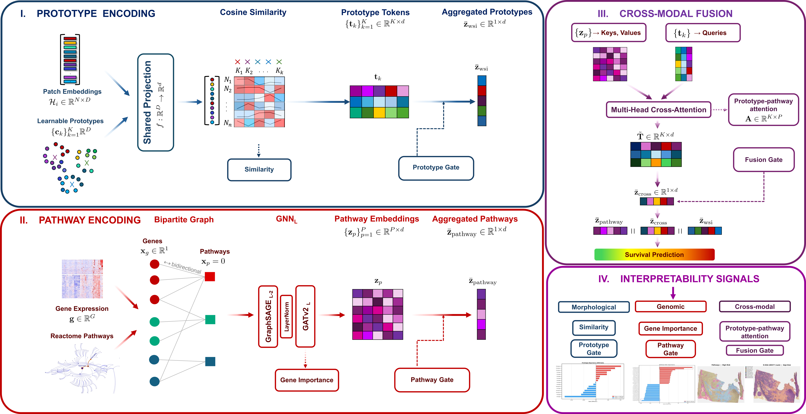

# ProtoPathway
 
**Interpretable-by-design multimodal cancer survival prediction**
 
ProtoPathway fuses whole slide image (WSI) morphology with bulk transcriptomics through semantically grounded representations. A bipartite graph neural network encodes gene expression over a Reactome and MSigDB Hallmark pathway graph, a prototype-based MIL encoder compresses gigapixel slides into a fixed set of learned morphological tokens, and asymmetric cross-attention lets the prototypes query the pathways. Every component is interpretable: the gene encoder exposes gene-pathway attention, the WSI encoder exposes patch-prototype assignments, and the fusion stage exposes a prototype-pathway attention matrix.


<p align="center">
  <a href="https://arxiv.org/abs/XXXX.XXXXX"></a>
  <a href="https://huggingface.co/AmayaGS/ProtoPathway"></a>
  <a href="LICENSE"></a>
  <a href="https://www.python.org/"></a>
  <a href="https://pytorch.org/"></a>
</p>


## Highlights
 
- **Compact and fast.** 480K parameters, 3.9G FLOPs, 13.6 ms per patient. Between 28 and 50 times faster than attention-based multimodal baselines (MCAT, SurvPath, MMP) thanks to the K=16 prototype bottleneck.
- **Strong performance.** Competitive C-index of 0.670 across five TCGA cohorts, ahead of 
  MCAT (0.662), SurvPath (0.660), and MMP (0.659).
- **Interpretable.** Every stage exposes a structured attention signal: gene-pathway attention, pathway gates, patch-prototype assignments, and a prototype-pathway cross-modal matrix.
- **Validated on five TCGA cohorts.** BRCA (N=714), BLCA (N=359), COADREAD (N=227), HNSC (N=392), and STAD (N=318), for a total of N=2,010 patients.

## Architecture
 
ProtoPathway has three components:
 
**Gene encoder.** A bipartite graph over 662 pathways and 4,574 genes (17,275 edges) drawn from Reactome and MSigDB Hallmark gene sets. Early layers use GraphSAGE with mean aggregation for stability under noisy survival supervision. The final layer is GATv2, which yields interpretable gene-pathway attention weights.
 
**WSI encoder.** PrototypeMIL with K=16 learned morphological prototypes. Patch features are softly assigned to prototypes by cosine similarity at temperature τ=0.1, then aggregated into a fixed set of K token embeddings.
 
**Fusion.** Asymmetric cross-attention where the prototypes query the pathways (A ∈ R^{K×P}). A three-gate combination merges a pathway-only stream, a raw-prototype stream, and a cross-attended-prototype stream before the survival head.

<p align="center">
  
</p>

## Installation

First clone the repository to the desired location and enter the directory:

```bash
# clone project to desired location
git clone https://github.com/AmayaGS/ProtoPathway
cd ProtoPathway
```

Then create a virtual environmemt and install the requirements.txt

#### General Requirements
- Python 3.11.7
- PyTorch 2.5
- NVIDIA GPU with CUDA 12.4

```bash
# Virtual Environment
python -m venv protopath
source protopath/bin/activate

# PyTorch with cuda capabilities
pip install torch==2.5.1 torchvision==0.20.1 --index-url https://download.pytorch.org/whl/cu124

pip install -r requirements.txt  

```

## Pretrained models and curated cohort data
 
The Hugging Face repo at [AmayaGS/ProtoPathway](https://huggingface.co/AmayaGS/ProtoPathway) ships preprocessed cohort data, so most users do not need to run the preprocessing pipeline themselves. The only piece you need to obtain separately is the WSI patch features.
 
### What is on the Hub
 
For each of the five TCGA cohorts (BRCA, BLCA, COADREAD, HNSC, STAD):
 
- `gene_expression.csv`: preprocessed gene expression matrix (from the SurvPath release)
- `bipartite_graph.pt`: cohort-specific gene-pathway graph
- `labels.csv`: survival times, events, and discretized risk bins
- `data_splits.pkl`: 5-fold cross-validation splits matching the SurvPath release
- `checkpoints/best_fold_{0..4}.pt`: trained model weights with `config.yaml`
Plus a shared curated Reactome and MSigDB Hallmark pathway file at `pathways/pathways_base_d5_g3-200_j100.pkl`.
 
Download everything for a single cohort with:
 
```python
from huggingface_hub import snapshot_download
 
snapshot_download(
    repo_id="AmayaGS/ProtoPathway",
    local_dir="./protopathway_assets",
    allow_patterns=["cohorts/TCGA-BLCA/*", "pathways/*"],
)
```
 
After downloading, update the `paths` and `input` blocks in `configs/experiments/experiment.yaml` to point at your local copies of `gene_expression.csv`, `bipartite_graph.pt`, `labels.csv`, and `data_splits.pkl`.
 
### What you still need to obtain
 
**WSI patch features.** UNI2-h embeddings are not redistributed here. The model expects per-slide HDF5 files with `features` and `coords` keys, one file per slide. You have two options:
 
1. Use pre-extracted UNI2-h features if they are already available for your cohort.
2. Download raw TCGA WSIs from the [GDC Data Portal](https://portal.gdc.cancer.gov) and extract features using [UNI2-h](https://huggingface.co/MahmoodLab/UNI2-h).
Once you have the per-slide HDF5 files, run the WSI preprocessing step to convert them into the per-patient `.pt` format ProtoPathway uses at training time:
 
```bash
python main.py preprocess wsi --config configs/preprocessing/preprocess_wsi.yaml dataset=TCGA-BLCA
```
 
## Quick start
 
All commands are run through the `main.py` entry point.
 
### 1. Edit the configs
 
The YAML files in `configs/` contain paths and hyperparameters. Update the `paths` blocks at the top of each file:
 
```yaml
paths:
  base_data_dir: /path/to/TCGA_data
  output_dir:    /path/to/results
```
 
### 2. Preprocess
 
```bash
# One-time: curate Reactome + Hallmark pathways
python main.py preprocess pathways --config configs/preprocessing/preprocess_pathways.yaml
 
# Per cohort: gene expression, WSI features, and splits
python main.py preprocess genes  --config configs/preprocessing/preprocess_genes.yaml  dataset=TCGA-BLCA
python main.py preprocess wsi    --config configs/preprocessing/preprocess_wsi.yaml    dataset=TCGA-BLCA
python main.py preprocess splits --config configs/preprocessing/create_splits.yaml     dataset=TCGA-BLCA
```
 
Or run all four steps at once:
 
```bash
python main.py preprocess all --config configs/preprocessing/preprocess_pathways.yaml
```
 
### 3. Train
 
```bash
python main.py train --config configs/experiments/experiment.yaml
```
 
CLI overrides use OmegaConf dot syntax:
 
```bash
python main.py train --config configs/experiments/experiment.yaml \
    dataset=TCGA-BRCA \
    model.fusion.type=cross_attention \
    training.learning_rate=1e-5
```
 
Baselines share the same entry point:
 
```bash
# Unimodal WSI
python main.py train --config configs/experiments/experiment.yaml model.name=abmil
python main.py train --config configs/experiments/experiment.yaml model.name=transmil
 
# Unimodal gene expression
python main.py train --config configs/experiments/experiment.yaml model.name=snn
 
# Multimodal baselines
python main.py train --config configs/experiments/experiment.yaml model.name=mcat
python main.py train --config configs/experiments/experiment.yaml model.name=survpath
python main.py train --config configs/experiments/experiment.yaml model.name=mmp
```
 
### 4. Evaluate
 
```bash
python main.py evaluate --checkpoint-dir results/TCGA-BLCA/<experiment_name>
```
 
This loads every fold checkpoint, computes the C-index, saves patient-level predictions, and exports attention weights for interpretability.
 
### 5. Visualize
 
```bash
python main.py visualize --eval-dir results/TCGA-BLCA/<experiment_name>/evaluation
```
 
To include spatial overlays on WSIs:
 
```bash
python main.py visualize \
    --eval-dir results/TCGA-BLCA/<experiment_name>/evaluation \
    --wsi-features-dir processed/TCGA-BLCA/wsi_features_per_patient \
    --wsi-dir /path/to/svs_files \
    --fold 1
```
 
For a single patient:
 
```bash
python main.py visualize \
    --eval-dir results/TCGA-BLCA/<experiment_name>/evaluation \
    --wsi-features-dir processed/TCGA-BLCA/wsi_features_per_patient \
    --patient TCGA-FD-A3B4 \
    --fold 1
```
 
### 6. Profile efficiency
 
```bash
python main.py profile --config configs/experiments/experiment.yaml --num-patients 30
```
 
Reports parameter count, FLOPs, peak VRAM, and training and inference time per patient.
 
---
 
## Project structure
 
```
ProtoPathway/
├── configs/
│   ├── preprocessing/         pathway, gene, WSI, and split preprocessing
│   └── experiments/           training and evaluation
├── preprocessing/             data preparation pipelines
├── models/
│   ├── protopath.py           the main model
│   ├── protopath_components/  gene encoder, WSI encoder, fusion
│   ├── baselines/             ABMIL, TransMIL, SNN, MCAT, MMP, PIBD, ...
│   └── factory.py             unified model builder
├── experiments/
│   ├── train.py
│   ├── evaluate.py
│   └── visualize.py           interpretability pipeline
├── utils/
│   ├── analysis/              cross-fold pooling, rank-based statistics
│   └── visualization/         KM curves, heatmaps, spatial overlays
├── scripts/
│   └── upload_to_hf.py        push checkpoints and assets to the Hub
└── main.py                    single CLI entry point
```
 
---
 
## Citation
 
If you use this code in your research, please cite:
 
```bibtex
@article{protopathway2026,
  title   = {ProtoPathway: Biologically Structured Prototype-Pathway Fusion for Multimodal Cancer Survival Prediction},
  author  = {Amaya Gallagher-Syed, Costantino Pitzalis, Myles J. Lewis, Michael R. 
  Barnes, Gregory Slabaugh},
  journal = {arxiv},
  year    = {2026},
}
```
 
## Acknowledgments
 
- [SurvPath](https://github.com/mahmoodlab/SurvPath) for the predefined TCGA CV splits and the per-pathway SNN baseline.
- [Mahmood Lab](https://huggingface.co/MahmoodLab) for the UNI2-h foundation model.
- [Reactome Consortium](https://reactome.org) and [MSigDB](https://www.gsea-msigdb.org/gsea/msigdb/) for pathway annotations.
- [TCGA](https://www.cancer.gov/ccg/research/genome-sequencing/tcga) for the public cohorts.
## License
 
This project is released under the MIT License. See [LICENSE](LICENSE) for details.
